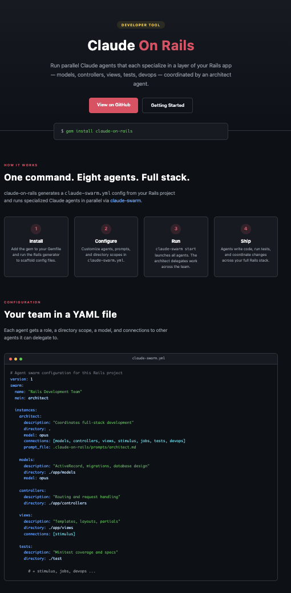
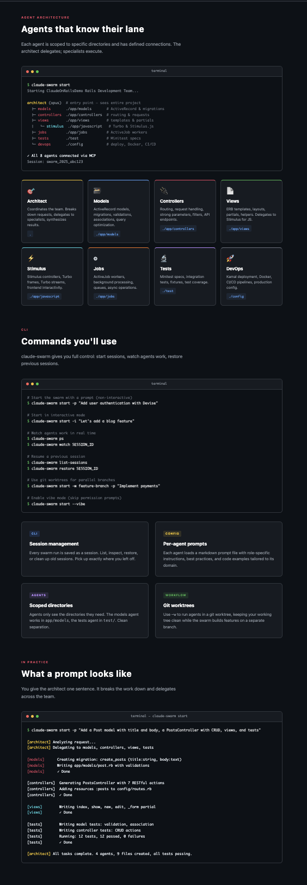
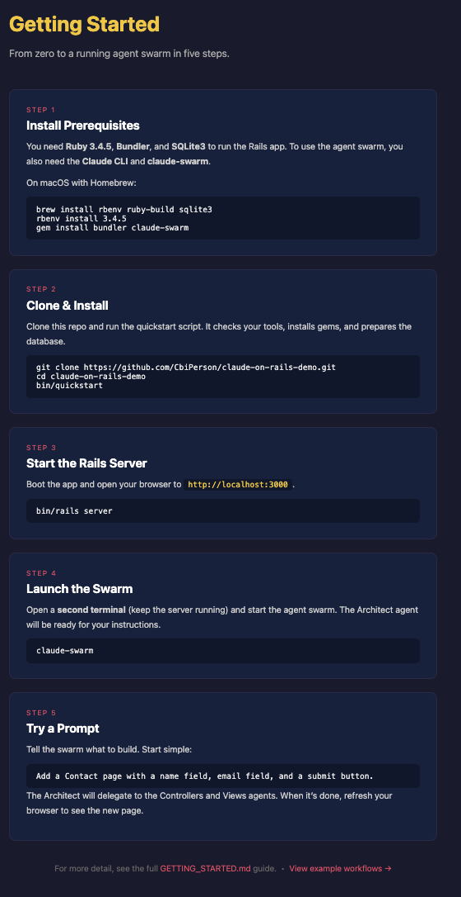
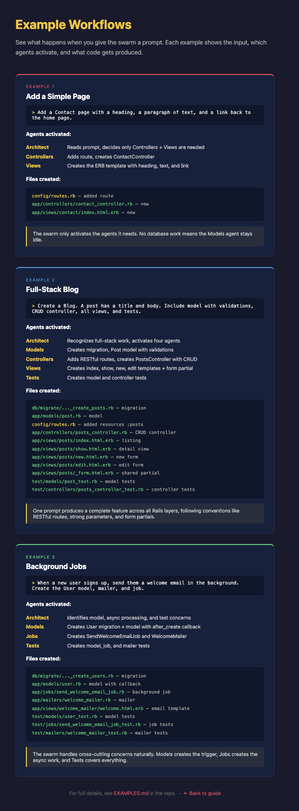

# claude-on-rails-demo

A working demo of [claude-on-rails](https://github.com/obie/claude-on-rails) -- an AI **agent swarm** for Rails development.

Instead of one AI assistant, you get a coordinated team: an architect that plans the work, and specialists for models, controllers, views, tests, and more. Each agent knows its domain and stays in its lane.



## What Is This?

Most AI coding tools give you a single chatbot. **claude-on-rails** gives you a _swarm_ -- multiple Claude agents that collaborate like a real development team:

1. You describe what you want in plain English
2. The **Architect** agent breaks it into tasks
3. Specialist agents (Models, Controllers, Views, Tests, ...) implement each piece in parallel
4. You get working code across every Rails layer

This repo is a ready-to-run example so you can see it in action.

## Agent Architecture



Eight agents defined in `claude-swarm.yml`, each scoped to a specific directory:

| Agent | Directory | Role |
|-------|-----------|------|
| **Architect** | `.` | Entry point. Coordinates the full team, delegates work |
| **Models** | `./app/models` | ActiveRecord, migrations, database design |
| **Controllers** | `./app/controllers` | Routing and request handling |
| **Views** | `./app/views` | Templates, layouts, partials |
| **Stimulus** | `./app/javascript` | Turbo and Stimulus.js integration |
| **Jobs** | `./app/jobs` | Background processing with ActiveJob |
| **Tests** | `./test` | Test coverage (Minitest) |
| **DevOps** | `./config` | Deployment, Docker, CI/CD |

The architect can delegate to all agents. The views agent can also delegate to stimulus for JS work.

## Prerequisites

| Tool | Why | Install |
|------|-----|---------|
| **Ruby 3.4.5** | Runs the Rails app | `brew install ruby` or [rbenv](https://github.com/rbenv/rbenv) |
| **Bundler** | Installs gems | `gem install bundler` |
| **SQLite3** | Default database | `brew install sqlite3` (usually pre-installed on macOS) |
| **Claude CLI** | Powers each agent | [Install guide](https://docs.anthropic.com/en/docs/claude-code/overview) |
| **claude-swarm** | Orchestrates the agents | `gem install claude-swarm` |

## Quick Start



```bash
# 1. Clone the repo
git clone https://github.com/CbiPerson/claude-on-rails-demo.git
cd claude-on-rails-demo

# 2. Run the quickstart script (checks prereqs, installs deps, prepares DB)
bin/quickstart

# 3. Start the Rails server
bin/rails server

# 4. Open a second terminal and launch the swarm
claude-swarm start
```

Then tell the swarm what to build:

```
> Add a Contact page with a name field and email field
```

The architect will coordinate the work across the specialist agents automatically.

## Example Workflows



The demo app includes three example walkthroughs showing different levels of agent coordination:

**Simple Page** -- Only controllers + views agents activate. Models stays idle because no database work is needed.

**Full-Stack Blog** -- All four core agents (models, controllers, views, tests) work together to produce a complete CRUD feature with migrations, routes, templates, and test coverage.

**Background Jobs** -- Cross-cutting concerns handled naturally. Models creates the trigger, jobs creates the async worker and mailer, tests covers everything.

## CLI Commands

```bash
# Start with a prompt (non-interactive)
claude-swarm start -p "Add user authentication with Devise"

# Interactive mode
claude-swarm start -i "Let's add a blog feature"

# Watch agents work in real time
claude-swarm ps
claude-swarm watch SESSION_ID

# Resume a previous session
claude-swarm list-sessions
claude-swarm restore SESSION_ID

# Use git worktrees for parallel branches
claude-swarm start -w feature-branch -p "Implement payments"

# Vibe mode (skip permission prompts)
claude-swarm start --vibe
```

## Project Structure

```
claude-swarm.yml                # Agent swarm configuration
.claude-on-rails/
  prompts/                      # Per-agent prompt files (markdown)
    architect.md                # Team coordination instructions
    models.md                   # ActiveRecord best practices
    controllers.md              # Routing/request patterns
    views.md                    # Template/partial guidelines
    stimulus.md                 # Turbo/Stimulus patterns
    jobs.md                     # ActiveJob patterns
    tests.md                    # Minitest conventions
    devops.md                   # Deployment config
  context.md                    # Shared project context
CLAUDE.md                       # Claude Code project instructions
app/
  controllers/                  # One controller per page
  views/                        # ERB templates with inline CSS
config/routes.rb                # Route definitions
test/controllers/               # Integration tests
docs/images/                    # Screenshots for README
```

## How the Swarm Works

```
You  -->  Architect  -->  Models agent      (creates migrations, model files)
                    -->  Controllers agent  (creates routes, controller actions)
                    -->  Views agent        (creates templates, partials)
                    -->  Tests agent        (creates test files)
                    -->  ...
```

The Architect reads your prompt, decides which agents to involve, and delegates. Each specialist works in its own directory with its own tools. The result is coordinated code across every layer -- just like a real team.

## Learn More

- **[GETTING_STARTED.md](GETTING_STARTED.md)** -- step-by-step setup from zero
- **[EXAMPLES.md](EXAMPLES.md)** -- full workflow walkthroughs
- **[claude-on-rails](https://github.com/obie/claude-on-rails)** -- the gem (upstream)
- **[swarmpod-core](https://github.com/CbiPerson/swarmpod-core)** -- the Rails template used as a starting point
- **[claude-swarm](https://github.com/parruda/claude-swarm)** -- the underlying agent orchestration framework
